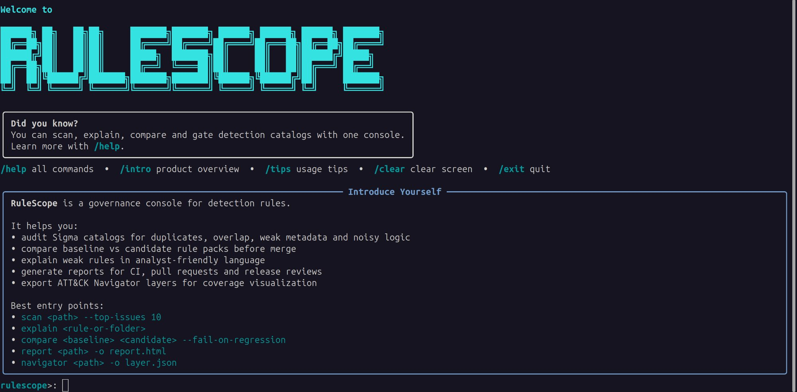
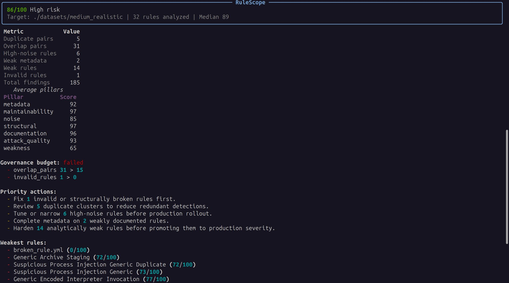
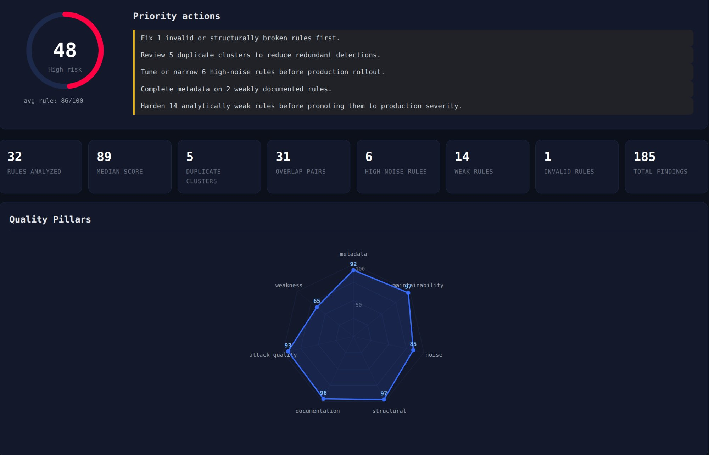

# RuleScope

[](https://github.com/Kjean13/rulescope/actions/workflows/ci.yml)
[](https://pypi.org/project/rulescope/)
[](LICENSE)
[](https://github.com/Kjean13/rulescope/actions)

**RuleScope** is a governance CLI for Sigma and detection catalogs.
It is built to answer one practical question before merge or release: **is this catalog still clean, selective, documented, and safe to operate?**

This **v1.0.0** release focuses on real-world blue-team governance: semantic duplicate detection, intent-aware weakness scoring, empirical lifecycle calibration, deterministic outputs, and CI-ready packaging.



## Positioning

RuleScope is **not** a Sigma converter, a SIEM, or a detection execution engine.
It is the quality-control layer that sits **around** detection content:

- audit catalog health
- explain weak rules
- compare baseline vs candidate packs
- gate releases in CI
- export governance reports and ATT&CK coverage views

That makes it useful for **detection engineering**, **content review**, **catalog maintenance**, and **release governance**.

## What it does

- **scan** a rule pack and score quality across metadata, noise, structure, ATT&CK mapping, maintainability, weakness, and documentation
- **detect semantic duplicates** using structured event-surface similarity instead of lexical YAML similarity
- **explain** why a rule is weak, with prioritized remediation guidance
- **compare** baseline vs candidate packs and surface semantic regressions
- **report** in HTML, Markdown, JSON, or SARIF
- **gate** pull requests and releases with deterministic quality budgets
- **show maintainer hotspots** to prioritize debt at catalog level
- **export ATT&CK Navigator layers** for coverage visualization
- **benchmark** large catalogs and keep throughput measurable
- **watch** a rule or folder during editing and re-scan on changes

## Real-world use cases

### 1. Pre-merge quality gate for a Sigma repository
A team updates a detection pack before a release. RuleScope compares the candidate pack to the baseline, flags semantic broadening, selector loss, ATT&CK coverage drift, and noisy logic, then blocks the merge if quality regresses.

### 2. Catalog cleanup after months of growth
A content repo has grown to hundreds or thousands of rules. RuleScope surfaces duplicate clusters, overlap, weak metadata, and the weakest rules first so maintainers can reduce debt without reading everything manually.

### 3. Detection review for a small SOC or training lab
An analyst wants to understand why a rule is fragile. RuleScope explains the weakest rules with prioritized recommendations and suggests the next changes to make detection more selective and production-ready.

## Core commands

```bash
rulescope scan ./rules --top-issues 10
rulescope explain ./rules --all --max-rules 5
rulescope compare ./baseline ./candidate --fail-on-regression
rulescope report ./rules -o rulescope_report.html
rulescope maintainers ./rules
rulescope navigator ./rules -o coverage_layer.json
rulescope ci ./rules --min-score 70
rulescope benchmark ./rules -o benchmark.md
```



## Quick start

```bash
python3 -m venv .venv
source .venv/bin/activate
pip install -e .
rulescope scan ./examples/rules --top-issues 5
```

For development:

```bash
pip install -e "[dev]"
python -m pytest -q
ruff check rulescope tests
python -m build
```

## HTML report

```bash
rulescope report ./rules -o report.html
```



## GitHub Action

```yaml
- name: RuleScope quality gate
  uses: Kjean13/rulescope@v1
  with:
    target: rules/
    min-score: "70"
    fail-on-regression: "true"
    format: sarif
    output: rulescope-report.sarif

- name: Upload SARIF
  uses: github/codeql-action/upload-sarif@v3
  with:
    sarif_file: rulescope-report.sarif
```

Full configuration reference: [docs/GITHUB_ACTIONS_PR_GATE.md](docs/GITHUB_ACTIONS_PR_GATE.md).

## Language support

RuleScope supports **English and French** for CLI outputs and reports.

```bash
rulescope --lang fr scan ./rules
rulescope explain ./rules --lang fr
rulescope report ./rules --lang fr -o report.html
```

## Demo datasets

- `examples/rules/` — minimal quick-start pack
- `datasets/medium_realistic/` — richer seeded pack for scan, report, and benchmark demos
- `datasets/regression_demo/` — baseline vs candidate fixtures for compare and CI testing

## Support matrix

Tested on Python 3.10 to 3.13.

## License

MIT
